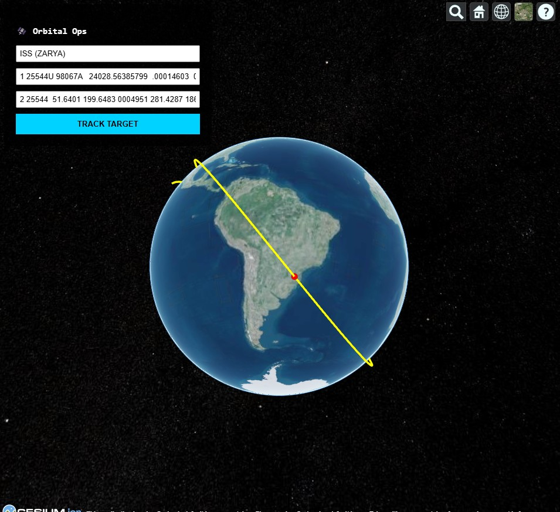

# 🛰️ Orbital Analytics Platform


**Orbital Analytics** is a production-grade, full-stack satellite tracking system. It combines high-precision astronomical calculations (Skyfield) with a modern 3D visualization engine (CesiumJS) to track Earth-orbiting objects in real-time.



## 🚀 Key Features

- **Physics Engine:** Calculates real-time satellite positions using TLE (Two-Line Element) data with SGP4 propagation (via Skyfield).
- **3D Visualization:** Interactive Digital Earth using CesiumJS / Resium.
- **Vectorized Trajectory:** Computes future and past orbital paths using NumPy for high performance.
- **Product-Minded API:** FastAPI backend with Pydantic validation, Documentation (Swagger UI), and CORS middleware.
- **DevSecOps:** Fully Dockerized environment, CI/CD pipeline via GitHub Actions, and strict input sanitization.

## 🛠️ Tech Stack & Architecture

### Backend (The Core)

- **Language:** Python 3.11
- **Framework:** FastAPI (Async High Performance)
- **Logic:** Skyfield (Astronomy), NumPy (Vectorization)
- **Validation:** Pydantic V2

### Frontend (The View)

- **Framework:** React 18 (Vite)
- **3D Engine:** CesiumJS (WebGL)
- **State Management:** React Hooks (Lifting State Up)

### Infrastructure

- **Containerization:** Docker (Multi-stage builds)
- **CI/CD:** GitHub Actions (Automated Testing & Linting)

## ⚡ Quick Start

### Option 1: Using Docker (Recommended)

The easiest way to run the system is using Docker. This ensures environment consistency.

```bash
# 1. Build the image
docker build -t orbital-app .

# 2. Run the container
docker run -p 8000:8000 orbital-app
```

### Option 2: Manual Setup

**Backend:**

```bash
python -m venv venv
source venv/bin/activate  # or .\venv\Scripts\activate on Windows
pip install -r requirements.txt
uvicorn app.main:app --reload
```

**Frontend:**

```bash
cd frontend
npm install
npm run dev
```

**🧪 Testing**
The system includes a suite of unit tests for the physics engine.

```Bash
# Run tests
python -m pytest
```

Built by Chen Paz as a Portfolio Project showcasing Full-Stack & DevSecOps capabilities.
